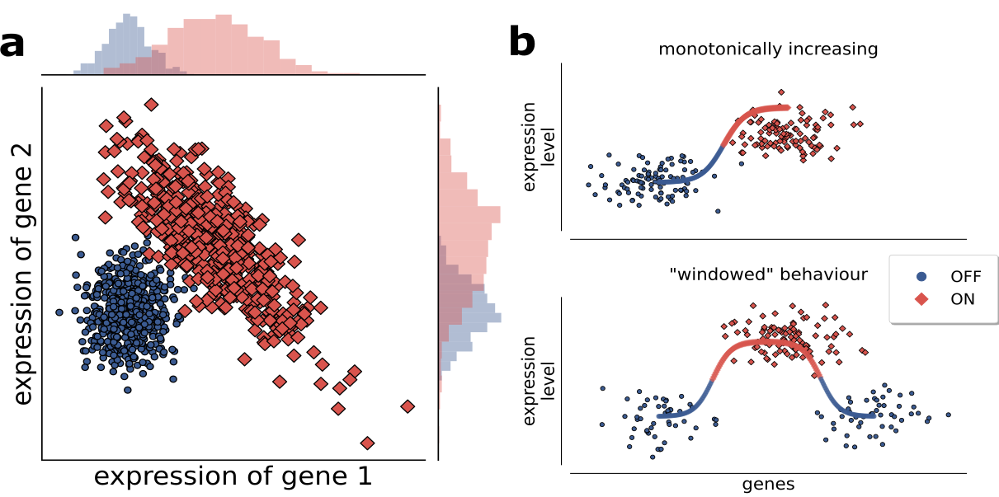

.. DNetPRO algorithm documentation master file, created by
   sphinx-quickstart on Fri Oct  2 12:42:24 2020.
   You can adapt this file completely to your liking, but it should at least
   contain the root `toctree` directive.

Welcome to DNetPRO algorithm's documentation!
==================================================================

Official implementation of the DNetPRO algorithm published on BioRXiv_ by Curti et al.
The `DNetPRO` algorithm produces multivariate signatures starting from all the couples of variables analyzed by a Discriminant Analysis.
The method is particularly designed to gene-expression data analysis and it was tested against the most common feature selection techniques.
In the current implementation the `DNetPRO` object is totally equivalent to a `scikit-learn` feature-selection method and thus it provides the member functions `fit` (to train your model) and `predict` (to test a trained model on new samples).
The combinatorial evaluation is performed using a `C++` version of the code wrapped using `Cython`.

Overview
========

Methods that select variables for multi-dimensional signatures based on single-variable performance can have limits in predicting
higher-dimensional signature performance.
As shown in the Figure (a), in which both variables taken singularly perform poorly, but their performance becomes optimal in a 2-dimensional combination, in terms of linear separation of the two classes.

It is known that complex separation surfaces characterize classification tasks associated to image and speech recognition, for which Deep Networks are used successfully in recent times, but in many cases biological data, such as gene or protein expression, are more likely characterized by a up/down-regulation behavior (as shown in Figure (b) top), while more complex behaviors (e.g. a optimal range of activity, Figure (b) bottom) are much less likely.
Thus, discriminant-based methods (and logistic regression methods alike) can very likely provide good classification performances in these cases (as demonstrated by our results with DNetPRO) if applied in at least
two-dimensional spaces.
Moreover, the of these methods (that generate very simple class separation surfaces, i.e. linear or quadratic) guarantee that a of a signature based on lower-dimensional signatures is feasible.

This consideration are relevant in particular for microarray data where we face on a small number of samples compared to a huge amount of variables (gene probes).
This kind of problem, often called problem (where `N` is the number of features, i.e variables, and `S` is the number of samples), tend to be prone to overfitting and they are classified to ill-posed.
The difficulty on the feature extraction can also increase due to noisy variables that can drastically affect the machine learning algorithms.
Often is difficult to discriminate between noise and significant variables and even more as the number of variables rises.

In this project we propose a new method of features selection - DNetPRO, *Discriminant Analysis with Network PROcessing* - developed to outperform the mentioned above problems.
The method is particularly designed to gene-expression data analysis and it was tested against the most common feature selection techniques.
The method was already applied on gene-expression datasets but my work focused on the benchmark of it and on its optimization for Big Data applications.
The pipeline algorithm is made by many different steps and only a part of it was designed to biological application: this allow me to apply (part of) the same techniques also in different kind of problems with good results (see Mizzi2018_).

Usage example
=============

You can use the `DNetPRO` algorithm into pure-Python modules or inside your C++ application.

C++ example
-----------

The easiest usage of `DNetPRO` algorithm is given by the example provided in the example_cpp_ folder.
This script includes an easy-to-use command line to run the `DNetPRO` algorithm on a dataset stored into a file.

.. code-block:: bash

	./bin/DNetPRO_couples
	Usage: ./DNetPRO_couples -f <std :: string> -o <std :: string> [-frac <St16remove_referenceIfE> ] [-bin <St16remove_referenceIbE> ] [-verbose <St16remove_referenceIbE> ] [-probeID <St16remove_referenceIbE> ] [-nth <St16remove_referenceIiE> ]

	DNetPRO couples evaluation 2.0

	optional arguments:
	        -f,   --input                   Input filename
	        -o,   --output                  Output filename
	        -s,   --frac                    Fraction of results to save
	        -b,   --bin                     Enable Binary output
	        -q,   --verbose                 Enable stream output
	        -p,   --probeID                 ProbeID name to skip (true/false)
	        -n,   --nth                     Number of threads to use

If you are interested in using `DNetPRO` algorithm inside your code you can simply import the `dnetpro_couples.h`_ and call the `dnetpro_couples` function.

Then all the results will be stored into a easy-to-manage `score` object.

Python example
--------------

The `DNetPRO` object is totally equivalent to a `scikit-learn` feature-selection method and thus it provides the member functions `fit` (to train your model) and `predict` (to test a trained model on new samples).

First of all you need to import the `DNetPRO` modules and then simply call the training/testing functions.

.. code-block:: python

	import pandas as pd
	from DNetPRO import DNetPRO
	from sklearn.naive_bayes import GaussianNB
	from sklearn.model_selection import train_test_split

	X = pd.read_csv('./example/data.txt', sep='\t', index_col=0, header=0)
	y = np.asarray(X.columns.astype(float).astype(int))
	X = X.transpose()

	X_train, X_test, y_train, y_test = train_test_split(X.values, y, test_size=0.33, random_state=42)

	dnet = DNetPRO(estimator=GaussianNB(), n_jobs=4, verbose=True)

	Xnew = dnet.fit_transform(X_train, y_train)
	print('Best Signature: {}'.format(dnet.get_signature()[0]))
	print('Score: {:.3f}'.format(dnet.score(X_test, y_test)))

.. _BioRXiv: https://www.biorxiv.org/content/early/2019/09/19/773622
.. _`scikit-learn`: https://github.com/scikit-learn/scikit-learn
.. _`scikit-optimize`: https://github.com/scikit-optimize/scikit-optimize
.. _Mizzi2018: https://doi.org/10.1140/epjds/s13688-018-0168-2
.. _example_cpp: https://github.com/Nico-Curti/DNetPRO/blob/master/example
.. _`dnetpro_couples.h`: https://github.com/Nico-Curti/DNetPRO/blob/master/include/dnetpro_couples.h
.. _`score`: https://github.com/Nico-Curti/DNetPRO/blob/master/include/score.h

.. toctree::
   :maxdepth: 2
   :caption: Contents:

   theory
   installation
   cppAPI/modules
   pyAPI/modules
   references